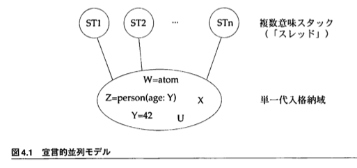
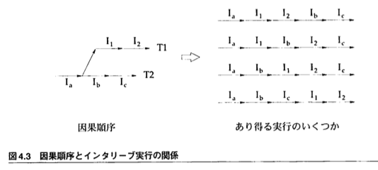
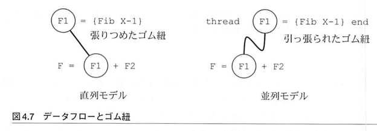
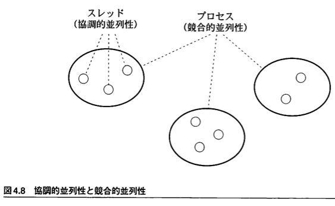
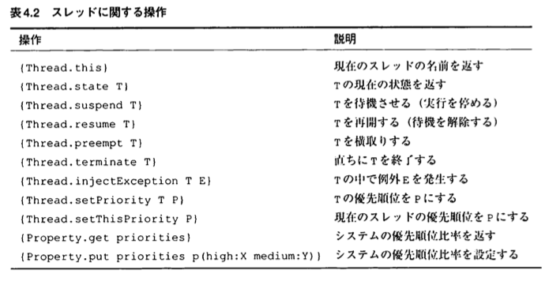

class: center, middle

# CTMCP読書会@mixi

2015/01/13

4章1節 - 4章2節 (p.241 - p.265)

[index](http://memerelics.github.io/ctmcp/)

---

## Index

#### 4章 宣言的並列性

* 4.1. データ駆動並列モデル
    * 4.1.1. 基本概念
    * 4.1.2. スレッドの意味
    * 4.1.3. 実行例
    * 4.1.4. 宣言的並列性とは何か？
* 4.2. スレッドプログラミングの基本的技法
    * 4.2.1. スレッドを生成すること
    * 4.2.2. スレッドとブラウザ
    * 4.2.3. スレッドを使うデータフロー計算
    * 4.2.4. スレッドのスケジューリング
    * 4.2.5. 協調的並列性と競合的並列性
    * 4.2.6. スレッド操作

---

class: center, middle

# 4章 宣言的並列性

---

## 並列性とは

独立に実行するアクティビティの集合として書かれるプログラムを 並列的(concurrent) であると言う

* エージェント, GUI, OSインタラクション
* クライアント/サーバプログラム, Productor/Consumerモデル

---

## 並列性は単純であり得る

すべてのプログラミング技法と推論技法をそのままに, 第2章の宣言的モデルへ並列性を追加することができる.

これを支えるのは

*データフロー変数はただ1つの値にしか束縛できない*

という事実. 観測可能な非決定性(observable nondeterminism)が*ない*.

この性質は宣言的並列モデルのプログラムにおいて, 同じ変数に両立しない値を束縛しようとしなければ常に成り立つ

* 並列性付与で変わらないもの: 並列的であろうとなかろうと, プログラムの結果は変わらない
* 並列性付与で変わるもの: プログラムの結果を漸増的に計算できるようになる(後述)

---

class: center, middle

# 例

---

class: center, middle

## 4.1 データ駆動並列モデル

---

## 宣言的計算モデル(2章)の拡張

### 第一段階の拡張

* 2章のモデルでは意味スタックの数はかならず1個だったが, 2個以上の存在を許す

* 命令 `thread <s> end` を追加
    * `thread` は実行文`<s>`を内容とする新しい意味スタックを追加する

--

### 第二段階の拡張 (4.5節)

* 別の実行順序を付与する
    * by-needトリガ `{ByNeed P X}`
* 要求駆動計算(demand-driven computation), あるいは遅延実行(lazy execution)が可能になる

---

class: center, middle

# 4.1 データ駆動並列モデル

## 4.1.1 基本概念

---

## 4.1.1 基本概念

2個以上の実行文が格納域を参照することを許す



---

## 4.1.1 基本概念

### インタリーブ (Interleaving)

2個以上の実行文は「同時に(at the same time)」実行される. 「同時に」の意味とは? => 視点が2個ある

--

#### A. 言語視点 (language viewpoint)

* スレッドにインタリーブ実行(interleaving execution)をさせる, と仮定
    * 各スレッドが交代で計算ステップを実行
    * 各計算ステップは原子的(atomic)

本書では「同時に」の意味として(A)を採用する.

---

## 4.1.1 基本概念

### インタリーブ (Interleaving)

2個以上の実行文は「同時に(at the same time)」実行される. 「同時に」の意味とは? => 視点が2個ある

#### B. 実装視点 (implementation viewpoint)

* システムが現実のマシン上でどのように実装されるかという視点
* マルチプロセッサ上にシステムが実装されていれば,
    * 現実世界の時間で「同時に」進めることが出来る.
    * 並行性を利用して性能を改善できる

本書では「同時に」の意味として(A)を採用する.

---

## 4.1.1 基本概念

### 因果順序 (Causal order)

宣言的計算モデルにおいては, 一方がデータフロー変数Xを束縛し, 他方がXの値を必要とするときこの二者間に因果順序があるという. 以下p.246より引用

> 与えられたプログラムについて, すべての計算ステップは半順序を成し, それを因果順序という. ある計算ステップs1が別の計算ステップs2の前に起きるとは, そのプログラムのあらゆる実行の仕方においてs1がs2より前に起きることをいう
>
> あるステップが別のステップの前でも後ろでもない場合もある. そういう場合, その2つのステップは並列的である, という.

---

### 因果順序 (Causal order)

* 半順序(partial-order)な集合とは, ある2個の要素間に順序比較(≦)が定義できるような集合を言う. 要素から要素へ順序が定義できないケースもある.
* 半順序集合のうち, 要素間の順序が必ず定義できる場合は全順序(total-order)集合であるという.

ref: http://en.wikipedia.org/wiki/Partially_ordered_set


---

### 因果順序 (Causal order)

* 直列プログラム
    * すべての計算ステップが全順序を成す.
    * 並列的ステップは存在しない.
* 並列プログラム
    * あるスレッド内のすべての計算ステップは全順序を成し,
    * プログラム全体の計算ステップは半順序を成す.



---

## 4.1.1 基本概念

### 非決定性 (nondeterministic)

実行中, 次にすることを選択すべき状態があれば, そういう実行は*非決定的*であるという.

宣言的並列モデルにおいて, 非決定性はプログラマから見えない. 理由は

1. データフロー変数に束縛されるのはただひとつの値であること
2. ある変数の値を必要とする場合「待つ」以外の選択肢は存在しないこと

の2点からなる.

逆に言えばこれら2点に選択の余地を与えると, 非決定性が目に見える形で現れてくる.

---

## 4.1.1 基本概念

### スケジューリング

スケジューラは実行するスレッドの選択を行う.

* ready (or runnable): 少なくともひとつの計算ステップを実行するのに必要なすべての情報を持っている状態
* suspended: 最初の文が実行に必要とするすべての情報を持っておらず, ブロックされている状態

スレッドがreadyであればいずれ実行されるようなシステムを公平である(fair)という

公平なシステムにおいては, スレッド間の関係が明示的に(データフロー変数という形で)プログラムされていない限り, 他のスレッドの実行に依存しない

本書においてはスレッドが公平にスケジュールされていると仮定する.

---

class: center, middle

# 4.1 データ駆動並列モデル

## 4.1.2 スレッドの意味

---

## 4.1.2 スレッドの意味

「スレッドの意味」 = Semantics of threads

2.4章の抽象マシン(p.62)を拡張

* 実行状態は対 `(MST, σ)` で表現
    * σ: 単一代入格納域. 初期状態ではΦ
    * MST: STのマルチセット `[ST1, ST2, ST3, ...]`
        * ST(意味スタック, semantic stack): 意味言明のスタック
            * 意味言明(semantic stack): 対 `(<s>, E)`
                * `<s>` は文
                * `E` は環境(= 変数識別子からσ内に存在する実体への写像)

初期状態は以下のようになる


---

## 4.1.2 スレッドの意味

### 概念

各ステップにおいて実行可能な意味スタックSTがひとつ選ばれ, マルチセットMSTはMST'となる.

その後STが実行される.

```
(ST, σ) -> (ST', σ')
```

全計算を見ると

```
({ST} \uplus MST', σ) -> ({ST'} \uplus MST', σ')
```

これをインタリーブ意味(interleaving semantics)と呼ぶ.

---

### 概念

* fairなスケジューリングアルゴリズムがSTの選択を行う(4.2.4節)
* MSTのすべてのSTが終了すれば「計算が終了した」という
    * 待機中のSTが少なくとも1個ありそれが解除できなければ「計算がブロックした」という

uplusについて


ref: [Multiset sums | A Singular Contiguity](http://singularcontiguity.wordpress.com/2008/05/14/multiset-sum/)

---

## 4.1.2 スレッドの意味

### thread文

thread文はマルチセットMSTをどのように変更するかに基づいて定義される. 選ばれたSTを実行していく中でthread文に出会うと, MSTに新しいスレッドが追加される.

```
({[(thread <s> end, E)] + ST'} \uplus MST', σ)
```

↓

```
({[(<s>, E)]} \uplus {ST'} \uplus MST', σ)
```


---

## 4.1.2 スレッドの意味

### メモリ管理

* 終了した意味スタックは解放してよい
* ブロックした意味スタックは, その活性化条件が到達不能な変数に依存していれば, 再利用できる(= 開放してもよい)

---

class: center, middle

# 4.1 データ駆動並列モデル

## 4.1.3 実行例

---

## 4.1.3 実行例

```
local B in
   thread B=true end
   if B then {Browse yes} end
end
```

* 3.3節(p.128)で導入した代入ベースの抽象マシンを使用する

---

class: center, middle

# 例

---

## 4.1.3 実行例

```
({[thread b=true end, if b then {Browse yes} end]},
 {b}∪σ)
```

bは格納域中の変数. この時点では意味スタックは1個.

---

## 4.1.3 実行例

```
({[b=true], [if b then {Browse yes} end]},
 {b}∪σ)
```

thread文を実行した後の様子.

最初の`b=true`を含む意味スタックはready状態なのでスケジューラがこれを選択, 実行する

---

## 4.1.3 実行例

```
({[], [if b then {Browse yes} end]},
 {b=true}∪σ)
```

最初のスレッドは終了し, 空の意味スタックが残る. これはメモリ管理によって取り除かれる.

---

## 4.1.3 実行例

```
({[if b then {Browse yes} end]},
 {b=true}∪σ)
```

if文を実行する

---

## 4.1.3 実行例

```
({[{Browse yes}]},
 {b=true}∪σ)
```

計算を進めるとyesが表示される.

---

class: center, middle

# 4.1 データ駆動並列モデル

## 4.1.4 宣言的並列性とは何か?

---

## 4.1.4 宣言的並列性とは何か?

宣言的プログラミングの原則: 「宣言的プログラムの出力はその入力の数学的関数であるべきである」

* 関数型プログラミングにおいてこの意味は明らか
* ではデータ駆動並列モデルにおいてはどうか?
    1. 入力と出力は束縛されていない変数を含むことが有り, 値とは限らない
    2. 入力が無限に成長するストリームであり得るので, 実行が終了しない可能性がある

---

## 4.1.4 宣言的並列性とは何か?

### 部分停止 (Partial termination)

```
fun {Double Xs}
   case Xs of X|Xr then 2*X|{Double Xr} end
end

Ys={Double Xs}
```

Xsが無限ストリームであればこのプログラムは決して終了しないが, Xsの成長が止まればプログラムは停止する.
このとき, プログラムは部分停止(Partial termination)するという.

---

## 4.1.4 宣言的並列性とは何か?

### 論理的同値 (Logical equivalence)

格納域の内容が「同じ(the same)」であるとはどういうことか.

```
X=1 Y=X  % 第1の場合
Y=X X=1  % 第2の場合
```

いずれの場合も, 格納域の内容が等しいことを意味する. 一方束縛されていない変数が出てくる場合は,

```
X=foo(Y W) Y=Z  % 第1の場合
X=foo(Z W) Y=Z  % 第1の場合
```

どちらの場合もXには同じレコードが束縛され, 論理的同値であると言う. 制約の考え方を使う(次p).

---

## 4.1.4 宣言的並列性とは何か?

### 論理的同値 (Logical equivalence)

簡単な定義を与える. .red.bold[*]

格納域束縛の集合のことを制約(constraint)と呼ぶ. 制約c下で変数xがとり得る値の集合を`values(x, c)`と定義する. このとき, ふたつの制約c1とc2が「論理的同値」であるとは

1. 両方が同じ変数を含み
2. 各変数xについて `values(x, c1) = values(x, c2)` となる

ことを言う

.footnote[.red.bold[*] 数学的に厳密な定義は9章, 13章.]

---

## 4.1.4 宣言的並列性とは何か?

### 論理的同値 (Logical equivalence)

例

```
x=foo(y x) ^ y=z
```

は

```
x=foo(z x) ^ y=z
```

と論理的に同値.

---

## 4.1.4 宣言的並列性とは何か?

### 宣言的並列性

並列的プログラムが宣言的であるとはどういうことか. 以下p.253より

並列的プログラムが宣言的であるとは, 可能なすべての入力に対して, 次が成り立つことをいう. 与えられた入力の集合に対するすべての実行が, 次の2つの結果のどちらかになる.

1. すべて停止しない
2. いずれ部分停止に至り, 論理的に同値な結果を出す

この定義によれば, データ駆動並列モデルは宣言的であることが証明できる.

---

## 4.1.4 宣言的並列性とは何か?

### 失敗

失敗(failure)とは, 格納域の中に矛盾する情報を格納しようとするときに生じる, 宣言的プログラムの異常終了

```
thread X=1 end
thread Y=2 end
thread X=Y end
```

どのような実行の仕方をしても矛盾は回避できず失敗する.

---

## 4.1.4 宣言的並列性とは何か?

### 失敗

* 誤りを修正
* 誤りを報告

するために, プログラム全体を終了させず, 実行を続けたいことがある. 例外は続行するためのひとつの方法である.

しかし, 例外が発生した後の実行はもはや宣言的ではない. 格納域の内容が実行の仕方に応じて異なるため. 先の例で言うと

```
(X, Y) は (1, 1), (1, 2), (2, 2) のすべての可能性がある
```

観測可能な非決定性が現れており, 「宣言的モデルを離れた(left the declarative model)」といえる.

---

## 4.1.4 宣言的並列性とは何か?

### 失敗の閉じ込め (Failure confinement)

失敗が起こったあとで再び実行を宣言的にしたければ, 非決定性を隠さなければならない. 例外が発生したら, XとYがデフォルト値に束縛されるようにする.

```
declare X Y
local X1 Y1 S1 S2 S3 in
   thread
      try X1=1 S1=ok catch _ then S1=error end
   end
   thread
      try Y1=2 S2=ok catch _ then S2=error end
   end
   thread
      try X1=Y1 S3=ok catch _ then S3=error end
   end
   if S1==error orelse S2==error orelse S3==error then
      X=1 % Xのデフォルト値
      Y=1 % Xのデフォルト値
   else X=X1 Y=Y1 end % エラーがなかったので計算結果を採用
end
```

---

class: center, middle

# 例

---

class: center, middle

# 4.2. スレッドプログラミングの基本的技法

---

class: center, middle

# 4.2. - 4.2.3

コード実行

[4.宣言的並列性 - GitHub](https://github.com/memerelics/ctmcp/blob/gh-pages/sec4/4.oz)

---

class: center, middle

# 4.2. スレッドプログラミングの基本的技法

## 4.2.3 スレッドを使うデータフロー計算

---

## 4.2.3 スレッドを使うデータフロー計算

### データフローとゴム紐



束縛するところと使うところが別スレッドにあるのでゴム紐が伸びる

---

## 4.2.3 スレッドを使うデータフロー計算

### 安価な並列性とプログラム構造

スレッド化する際にあまり資源を使わないのが理想. Mozartのスレッドは非常に安価で, メモリ256MBでアクティブスレッド10万超えても余裕

並列にしてプログラム構造が簡単になるならためらわず並列にすべきだが, いかに安価であっても直列のほうが常に安価な点には注意.

---

class: center, middle

# 4.2. スレッドプログラミングの基本的技法

## 4.2.4 スレッドのスケジューリング

---

## 4.2.4 スレッドのスケジューリング

スケジューラは公平(fair)であるべき. すなわちreadyなスレッドはすべていずれ実行されるようにすべきである.

他にスケジューラが注意すべきこととして以下を取り上げる

* タイムスライス
* 優先順位レベル
* 優先順位の継承
* タイムスライスの長さ

---

## 4.2.4 スレッドのスケジューリング

### タイムスライス

##### ラウンドロビン(round-robin)スケジューリング

すべてのreadyスレッドがキューに入っており, キューから最初のスレッドを取り出して*数ステップ*実行, またキューに戻す方式

* 「数ステップ」は実際どう決めるか?
    * 1ステップずつと決めてしまうと, キュー管理のオーバーヘッドが大きすぎる
    * そこで, タイムスライス(あるいはクォンタムquantum)と呼ばれるmax実行時間を決めておき, 割り当て時間が尽きるとそのスレッドの実行を停めることにする.

このように実行中スレッドを停めることを横取り(preemption)という.

---

## 4.2.4 スレッドのスケジューリング

### タイムスライス

各スレッドに割り当てられるプロセッサ時間を等しくするためスケジューラは以下のいずれかの方式を採用する

1. 計数法
    * スレッドの実行ステップを数え, 同数の単位時間を与える
    * 同じプログラムを2度走らせると, 同じタイミングで横取りが行われる
    * 厳しいリアルタイムアプリケーションなどに採用される
2. タイマ法
    * ハードウェアタイマを利用して各スレッドに同じ時間を与える
    * 効率が良い
    * ハードウェアのイベントに左右される

Mozartは(2)のタイマ法を採用

---

## 4.2.4 スレッドのスケジューリング

### 優先順位レベル

いくつかの優先順位レベルを決め, レベルごとにプロセッサ時間の最小パーセンテージを持つ. 同一レベルのスレッドはプロセッサ時間を公平に分け合う.

* Mozartの実装例
    * スレッドを高, 中, 低の3レベルに分け, それぞれ1個のキューを持つ
    * プロセッサ時間は高:中:低に100:10:1の割合(約90%:9%:1%)で分配される.
        * MozartのPropertyモジュールを使ってこれらのデフォルト値を変更可能

---

## 4.2.4 スレッドのスケジューリング

### 優先順位の継承

あるスレッドが子スレッドを生成すると, 親と同じ優先度が与えられる.

子スレッドのレベルは親のレベルより低くてはならない. もし高レベルの親が中レベルの子を生成しようとすると,

1. 高レベル親スレッドが子スレッドを生成
2. 子スレッドはデフォルトで高レベルになる
    * ★ この間に何度か子スレッドが実行される可能性がある
3. 子スレッドのレベルを中に設定し直す

★部分が原因で追跡困難なバグを生じる可能性がある

---

## 4.2.4 スレッドのスケジューリング

### タイムスライスの長さ

* タイムスライスが短いと
    * ◯: きめ細かい(fine-grained)並列性
    * ×: スレッド切替のオーバーヘッドが深刻になる

例: タイムスライス10ms, 10万スレッド => 各スレッドは1000秒で1タイムスライスを獲得

外部に依存していなければタイムスライスいっぱいまで使うことはほぼないので問題ない

---

class: center, middle

# 4.2. スレッドプログラミングの基本的技法

## 4.2.5. 協調的並列性と競合的並列性

---

## 4.2.5. 協調的並列性と競合的並列性

* 協調的並列性
    * スレッドはこちら
    * 同じ目的を目指して共に働く実体
* 競合的並列性
    * OSのプロセス
    * それぞれの目的を目指す実体



---

## 4.2.5. 協調的並列性と競合的並列性

Mozartは, 分散計算モデルとRemoteモジュールで競合的並列性を支援する.

* Remoteモジュール
    * 自分用の計算資源を持つ, 別のOSプロセスを生成
* 分散計算モデル
    * ネットワーク透過
    * 同じプログラムが異なる分散構造の上で走り, 同じ結果を出す

---

class: center, middle

# 4.2. スレッドプログラミングの基本的技法

## 4.2.6. スレッド操作

---

## 4.2.6. スレッド操作



---

## 4.2.6. スレッド操作

* スレッドの優先順位P
    * high, medium, lowのいずれか
* スレッドの状態
    * runnable, blocked, terminatedのいずれか
